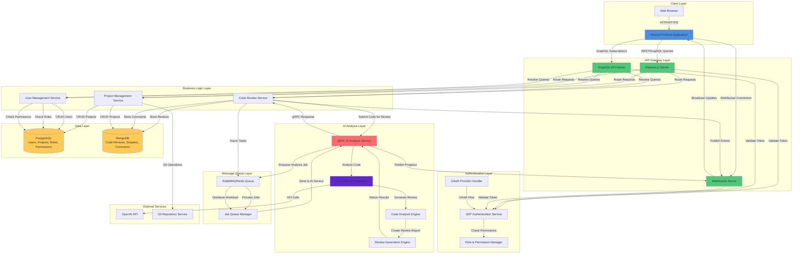

# AI-Assisted Live Code Review Platform

## Architecture Diagram

## Backend Development Guide

### Phase 1: Project Setup

#### 1.1 Initialize Project Structure
- Create root directory with organized folder structure (backend, frontend, shared, docs)
- Initialize Node.js project with package.json
- Set up TypeScript configuration for type safety
- Configure ESLint and Prettier for code quality
- Set up environment variable management (.env files with validation)
- Create .gitignore file with appropriate exclusions
- Initialize Git repository

#### 1.2 Install Core Dependencies
- Install Express.js framework and middleware
- Install GraphQL dependencies (Apollo Server, GraphQL tools)
- Install gRPC libraries and protocol buffers compiler
- Install database drivers (pg for PostgreSQL, mongoose for MongoDB)
- Install authentication libraries (JWT, bcrypt, passport)
- Install validation libraries (Joi, express-validator)
- Install testing frameworks (Jest, Supertest)
- Install development tools (nodemon, ts-node)

#### 1.3 Configure Build Tools
- Set up TypeScript compilation configuration
- Configure build scripts for development and production
- Set up hot-reload for development environment
- Configure environment-specific build outputs

### Phase 2: Database Schema Design

#### 2.1 PostgreSQL Schema Design
- Design users table (id, email, password_hash, created_at, updated_at)
- Design projects table (id, name, description, owner_id, created_at, updated_at)
- Design roles table (id, name, description)
- Design permissions table (id, name, resource, action)
- Design role_permissions junction table
- Design user_roles junction table (with project_id for project-level roles)
- Design project_members table (user_id, project_id, role_id)
- Create database migration files for schema versioning
- Design indexes for frequently queried columns

#### 2.2 MongoDB Schema Design
- Design code_reviews collection schema (review_id, project_id, code_snippet, status, ai_analysis, created_at, updated_at)
- Design code_snippets collection schema (snippet_id, review_id, file_path, content, language, line_numbers)
- Design comments collection schema (comment_id, review_id, snippet_id, user_id, content, line_number, type, created_at, updated_at)
- Design review_history collection for audit trail
- Design review_metrics collection for analytics
- Create Mongoose models and schemas with validation

#### 2.3 Database Connection Setup
- Configure PostgreSQL connection pool
- Configure MongoDB connection with retry logic
- Implement connection health checks
- Set up database migration runner
- Create seed data scripts for development

### Phase 3: Authentication & Authorization

#### 3.1 Authentication Service Implementation
- Implement user registration endpoint with email validation
- Implement password hashing with bcrypt (salt rounds configuration)
- Implement login endpoint with JWT token generation
- Implement token refresh mechanism
- Implement OAuth integration setup (GitHub, Google) if required
- Implement logout functionality with token blacklisting
- Create middleware for token verification

#### 3.2 Authorization System
- Implement role-based access control (RBAC) middleware
- Create permission checking utility functions
- Implement project-level permission system
- Design permission matrix for all resources and actions
- Implement admin override capabilities
- Create authorization decorators/middleware for routes

#### 3.3 Session Management
- Implement JWT token storage strategy (HTTP-only cookies vs localStorage)
- Configure token expiration policies
- Implement session timeout handling
- Create session invalidation on password change

### Phase 4: gRPC Service Creation

#### 4.1 Protocol Buffer Definitions
- Define code_analysis.proto file with service definitions
- Define request/response message types for code submission
- Define streaming message types for real-time updates
- Define error message types and status codes
- Compile proto files to generate TypeScript/JavaScript stubs

#### 4.2 gRPC Server Implementation
- Create gRPC server instance with SSL/TLS configuration
- Implement AnalyzeCode RPC method
- Implement StreamAnalysisProgress RPC method for live updates
- Implement BatchAnalyzeCode RPC method for bulk processing
- Set up request validation and error handling
- Implement server-side streaming for progress updates

#### 4.3 gRPC Client Implementation
- Create gRPC client connection pool
- Implement client wrapper for service calls
- Add retry logic with exponential backoff
- Implement circuit breaker pattern for resilience
- Add request timeout configuration
- Create client-side error handling and logging

#### 4.4 Service Communication
- Set up service discovery mechanism
- Configure load balancing for gRPC services
- Implement health check endpoints
- Set up monitoring and metrics collection

### Phase 5: GraphQL API Layer

#### 5.1 GraphQL Schema Design
- Define User type and related queries/mutations
- Define Project type with nested relationships
- Define CodeReview type with all fields
- Define Comment type and nested structures
- Define ReviewAnalysis type for AI results
- Create input types for mutations
- Design subscription types for real-time updates
- Implement pagination with cursor-based approach

#### 5.2 GraphQL Resolvers Implementation
- Implement User resolvers (queries, mutations)
- Implement Project resolvers with authorization checks
- Implement CodeReview resolvers for CRUD operations
- Implement Comment resolvers with real-time updates
- Create DataLoader instances to prevent N+1 queries
- Implement field-level authorization in resolvers
- Add input validation in resolvers

#### 5.3 Apollo Server Configuration
- Configure Apollo Server with Express integration
- Set up authentication context for GraphQL requests
- Configure CORS policies
- Implement request logging and monitoring
- Set up query complexity analysis
- Configure query depth limiting
- Implement rate limiting for GraphQL endpoints

#### 5.4 GraphQL Subscriptions
- Set up WebSocket server for subscriptions
- Implement subscription resolvers for code reviews
- Implement subscription resolvers for comments
- Implement subscription resolvers for review progress
- Set up subscription authentication
- Handle connection lifecycle (connect, disconnect, error)

### Phase 6: AI Integration

#### 6.1 OpenAI/LLM Integration Setup
- Configure OpenAI API client with API key management
- Implement API rate limiting and quota management
- Set up fallback mechanism for API failures
- Configure model selection (GPT-4, GPT-3.5-turbo, etc.)
- Implement cost tracking and budgeting alerts

#### 6.2 Code Analysis Engine
- Create code preprocessing pipeline (language detection, syntax validation)
- Design prompt engineering templates for code review
- Implement context building (file relationships, project structure)
- Create analysis result parser and formatter
- Implement multi-language support detection and handling

#### 6.3 Review Generation Engine
- Design review generation logic with structured output
- Implement severity classification (critical, high, medium, low, info)
- Create categorization system (security, performance, best practices, bugs)
- Implement code suggestion generation
- Add code examples and explanations to reviews

#### 6.4 AI Service Orchestration
- Integrate AI analysis into gRPC service handlers
- Implement async processing with job queue
- Add progress tracking for long-running analyses
- Implement result caching to reduce API calls
- Set up result post-processing and enhancement

### Phase 7: Code Review Logic

#### 7.1 Code Submission Service
- Create endpoint for code snippet submission
- Implement file parsing and validation
- Extract metadata (language, file path, line numbers)
- Store code snippets in MongoDB
- Generate unique identifiers for submissions

#### 7.2 Review Processing Pipeline
- Implement review workflow state machine (pending, analyzing, completed, failed)
- Create review job creation and queuing logic
- Implement review result aggregation from AI service
- Create review persistence logic in MongoDB
- Update review status and metadata

#### 7.3 Comment System
- Implement comment creation on code reviews
- Add support for inline comments (line-specific)
- Implement comment threading and replies
- Create comment editing and deletion with permissions
- Implement comment notifications and mentions

#### 7.4 Review Management
- Implement review retrieval with filtering and sorting
- Create review history tracking
- Implement review status updates
- Add review sharing and collaboration features
- Create review export functionality

### Phase 8: Real-time Updates

#### 8.1 WebSocket Server Setup
- Integrate WebSocket server with Express
- Implement connection management and authentication
- Create room/channel system for project-based updates
- Handle connection lifecycle events
- Implement heartbeat/ping-pong for connection health

#### 8.2 Event Publishing System
- Design event types for code review updates
- Implement event emitter for internal events
- Create event transformation layer for WebSocket messages
- Implement event filtering and routing
- Add event persistence for replay capability

#### 8.3 Real-time Features
- Implement live review progress updates
- Add real-time comment notifications
- Create live collaboration indicators
- Implement typing indicators for comments
- Add real-time review status changes

### Phase 9: Testing

#### 9.1 Unit Testing
- Write unit tests for authentication service
- Write unit tests for GraphQL resolvers
- Write unit tests for database operations
- Write unit tests for AI integration logic
- Write unit tests for utility functions
- Achieve minimum 80% code coverage

#### 9.2 Integration Testing
- Test API endpoint integrations
- Test GraphQL query and mutation flows
- Test database operations end-to-end
- Test gRPC service communication
- Test authentication and authorization flows

#### 9.3 End-to-End Testing
- Test complete code review workflow
- Test real-time update flows
- Test multi-user collaboration scenarios
- Test error handling and recovery
- Test performance under load

#### 9.4 Testing Infrastructure
- Set up test databases (separate from development)
- Configure test environment variables
- Create test fixtures and seed data
- Set up continuous integration pipeline
- Configure automated test reporting

### Phase 10: Deployment

#### 10.1 Production Configuration
- Configure production environment variables
- Set up production database connections
- Configure SSL/TLS certificates
- Set up logging infrastructure (Winston, Pino)
- Configure monitoring and alerting (Prometheus, Grafana)

#### 10.2 Containerization
- Create Dockerfile for backend services
- Create docker-compose.yml for local development
- Set up multi-stage builds for optimization
- Configure container health checks
- Set up Docker registry for images

#### 10.3 CI/CD Pipeline
- Set up automated testing in CI
- Configure automated builds on push
- Set up automated deployment to staging
- Configure deployment to production with approvals
- Set up rollback procedures

#### 10.4 Infrastructure Setup
- Configure server infrastructure (cloud provider)
- Set up load balancers and reverse proxies
- Configure auto-scaling policies
- Set up database backups and replication
- Configure CDN for static assets
- Set up disaster recovery procedures

#### 10.5 Security Hardening
- Implement rate limiting on all endpoints
- Set up API key rotation policies
- Configure CORS policies strictly
- Implement input sanitization and validation
- Set up security headers (Helmet.js)
- Configure dependency vulnerability scanning
- Set up secrets management (Vault, AWS Secrets Manager)

#### 10.6 Monitoring & Observability
- Set up application performance monitoring (APM)
- Configure error tracking (Sentry, Rollbar)
- Implement structured logging
- Set up distributed tracing
- Create health check endpoints
- Configure alerting for critical metrics

## Frontend Development Guide

### Phase 1: Next.js Setup

#### 1.1 Project Initialization
- Initialize Next.js project with TypeScript
- Configure Next.js app router structure
- Set up project folder organization (components, lib, hooks, types, styles)
- Configure path aliases for clean imports
- Set up environment variable management

#### 1.2 UI Framework Setup
- Install and configure Tailwind CSS
- Set up custom Tailwind theme configuration
- Create base component library structure
- Configure CSS modules or styled-components if needed
- Set up responsive design breakpoints

#### 1.3 Development Tools Configuration
- Configure ESLint and Prettier
- Set up Husky for git hooks
- Configure TypeScript strict mode
- Set up testing framework (Jest, React Testing Library)
- Install development browser extensions (React DevTools)

#### 1.4 Build Configuration
- Configure Next.js build optimization
- Set up code splitting strategies
- Configure image optimization
- Set up static page generation where applicable
- Configure bundle analyzer for optimization

### Phase 2: Authentication UI

#### 2.1 Authentication Pages
- Design and implement login page UI
- Design and implement registration page UI
- Create password reset request page
- Create password reset confirmation page
- Design OAuth provider login buttons

#### 2.2 Authentication Components
- Create reusable input components with validation
- Build form validation utilities
- Create error message display components
- Implement loading states for auth actions
- Create password strength indicator

#### 2.3 Authentication State Management
- Set up authentication context/provider
- Implement token storage strategy
- Create authentication hooks (useAuth, useLogin, useLogout)
- Implement automatic token refresh logic
- Handle authentication state persistence

#### 2.4 Protected Routes
- Create protected route wrapper component
- Implement route guards for authenticated pages
- Handle unauthorized access redirects
- Implement role-based route protection
- Create loading states during auth checks

### Phase 3: Dashboard UI

#### 3.1 Dashboard Layout
- Design main application layout structure
- Create navigation sidebar component
- Implement header with user menu
- Design responsive layout for mobile/tablet/desktop
- Create breadcrumb navigation component

#### 3.2 Project List View
- Design project grid/list view component
- Implement project card component
- Create project creation modal/form
- Add project search and filtering
- Implement project sorting options

#### 3.3 Dashboard Widgets
- Create statistics cards component
- Design recent reviews widget
- Create activity feed component
- Implement project quick actions
- Design notification center component

#### 3.4 Dashboard State Management
- Set up state management for projects (React Query or Zustand)
- Implement project data fetching and caching
- Create optimistic updates for project actions
- Handle error states and retry logic
- Implement infinite scroll or pagination

### Phase 4: Code Submission UI

#### 4.1 Code Editor Integration
- Integrate code editor library (Monaco Editor, CodeMirror)
- Configure syntax highlighting for multiple languages
- Implement code editor themes
- Add line number display and gutter
- Configure editor keyboard shortcuts

#### 4.2 File Upload Component
- Create drag-and-drop file upload area
- Implement file selection dialog
- Add support for multiple file uploads
- Display uploaded file list with metadata
- Implement file removal functionality

#### 4.3 Code Input Methods
- Create manual code paste input area
- Implement Git repository URL input
- Add file tree browser for project selection
- Create code snippet selection tool
- Implement code diff viewer

#### 4.4 Submission Form
- Design review request form layout
- Create form field components (project selector, title, description)
- Implement form validation
- Add submission progress indicator
- Handle submission success/error states

### Phase 5: Live Review UI

#### 5.1 Review Display Component
- Design review detail page layout
- Create code snippet display with line numbers
- Implement syntax highlighting in review view
- Create review metadata display (status, AI analysis, timestamps)
- Design review actions toolbar

#### 5.2 AI Analysis Display
- Create analysis results panel component
- Design severity indicator badges
- Implement categorization tabs/filters
- Create expandable issue details component
- Add code suggestion display with syntax highlighting

#### 5.3 Comment System UI
- Design comment thread display
- Create inline comment markers on code
- Implement comment creation form
- Add comment editing and deletion UI
- Create comment reactions/actions

#### 5.4 Review Navigation
- Implement review list sidebar
- Create review filtering and search
- Add review status filters
- Implement review sorting options
- Create review pagination controls

### Phase 6: API Integration

#### 6.1 GraphQL Client Setup
- Set up Apollo Client or urql GraphQL client
- Configure client with authentication headers
- Set up client-side caching strategy
- Configure error handling and retry logic
- Implement request/response interceptors

#### 6.2 Query Hooks Creation
- Create custom hooks for user queries
- Create custom hooks for project queries
- Create custom hooks for review queries
- Implement query loading and error states
- Add query refetching and invalidation logic

#### 6.3 Mutation Hooks Creation
- Create custom hooks for authentication mutations
- Create custom hooks for project mutations
- Create custom hooks for review mutations
- Create custom hooks for comment mutations
- Implement optimistic update patterns

#### 6.4 API Service Layer
- Create API service abstraction layer
- Implement typed API request/response interfaces
- Create API error handling utilities
- Implement request cancellation for cleanup
- Add API response transformation utilities

### Phase 7: Real-time Updates

#### 7.1 WebSocket Client Setup
- Integrate WebSocket client library
- Create WebSocket connection manager
- Implement connection authentication
- Handle connection lifecycle (connect, disconnect, reconnect)
- Add connection status indicator UI

#### 7.2 Subscription Implementation
- Set up GraphQL subscriptions client
- Implement subscription hooks for reviews
- Implement subscription hooks for comments
- Implement subscription hooks for review progress
- Handle subscription errors and reconnection

#### 7.3 Real-time UI Updates
- Implement live review progress updates
- Add real-time comment notifications
- Create live collaboration indicators
- Implement typing indicators
- Add real-time review status changes

#### 7.4 Notification System
- Create notification component library
- Implement toast notification system
- Create notification center UI
- Add browser notification support
- Implement notification preferences

### Phase 8: State Management

#### 8.1 Global State Setup
- Choose state management solution (Zustand, Redux Toolkit, or Context API)
- Set up global state store structure
- Create action creators and reducers (if using Redux)
- Implement state persistence where needed
- Set up state dev tools integration

#### 8.2 Component State Management
- Implement local state with React hooks
- Create custom hooks for component logic
- Implement form state management
- Handle component lifecycle with hooks
- Optimize re-renders with memoization

#### 8.3 Server State Management
- Set up React Query or SWR for server state
- Configure cache invalidation strategies
- Implement background data synchronization
- Handle stale-while-revalidate patterns
- Set up offline support with caching

### Phase 9: UI/UX Enhancements

#### 9.1 Component Library
- Create reusable button components with variants
- Design input components (text, textarea, select)
- Create modal/dialog components
- Design card and container components
- Build loading skeleton components

#### 9.2 Animation & Transitions
- Implement page transition animations
- Add component entrance/exit animations
- Create loading spinner animations
- Implement smooth scrolling behaviors
- Add micro-interactions for better UX

#### 9.3 Responsive Design
- Ensure mobile-first responsive layout
- Test on multiple screen sizes
- Optimize touch interactions for mobile
- Implement responsive navigation patterns
- Test on different devices and browsers

#### 9.4 Accessibility
- Add ARIA labels to interactive elements
- Implement keyboard navigation support
- Ensure color contrast compliance (WCAG AA)
- Add screen reader support
- Test with accessibility tools

### Phase 10: Performance Optimization

#### 10.1 Code Splitting
- Implement route-based code splitting
- Lazy load heavy components
- Split vendor bundles efficiently
- Use dynamic imports for conditional loading
- Optimize bundle size analysis

#### 10.2 Image Optimization
- Configure Next.js image optimization
- Implement lazy loading for images
- Use appropriate image formats (WebP, AVIF)
- Add image placeholders and blur effects
- Optimize image sizes and dimensions

#### 10.3 Caching Strategies
- Implement browser caching headers
- Set up service worker for offline support
- Configure API response caching
- Implement client-side cache invalidation
- Use CDN for static assets

#### 10.4 Performance Monitoring
- Integrate performance monitoring tools
- Set up Core Web Vitals tracking
- Monitor bundle sizes and load times
- Implement performance budgets
- Create performance dashboard

### Phase 11: Testing

#### 11.1 Unit Testing
- Write unit tests for utility functions
- Test custom React hooks
- Test component rendering logic
- Achieve minimum 70% code coverage
- Set up test mocking and fixtures

#### 11.2 Component Testing
- Write tests for component behavior
- Test user interactions (clicks, inputs)
- Test component state changes
- Test component props and rendering
- Use React Testing Library best practices

#### 11.3 Integration Testing
- Test complete user flows
- Test API integration with mocked responses
- Test form submissions end-to-end
- Test authentication flows
- Test real-time update scenarios

#### 11.4 E2E Testing
- Set up Playwright or Cypress
- Write E2E tests for critical paths
- Test cross-browser compatibility
- Test mobile device interactions
- Set up E2E test CI integration

### Phase 12: Deployment

#### 12.1 Build Configuration
- Configure production build settings
- Set up environment variable management
- Optimize production bundle
- Configure static export if needed
- Test production build locally

#### 12.2 Static Asset Management
- Configure CDN for static assets
- Set up asset versioning
- Optimize font loading strategies
- Implement resource hints (preconnect, prefetch)
- Configure favicon and meta tags

#### 12.3 Deployment Setup
- Configure deployment platform (Vercel, Netlify, AWS)
- Set up deployment pipelines
- Configure custom domain and SSL
- Set up staging and production environments
- Implement deployment previews

#### 12.4 Monitoring & Analytics
- Integrate error tracking (Sentry)
- Set up analytics (Google Analytics, Plausible)
- Configure performance monitoring
- Set up uptime monitoring
- Create monitoring dashboard

#### 12.5 SEO Optimization
- Implement meta tags for pages
- Create sitemap generation
- Configure robots.txt
- Implement structured data (JSON-LD)
- Optimize page titles and descriptions

#### 12.6 Post-Deployment
- Set up health check endpoints
- Configure error logging and alerts
- Create deployment documentation
- Set up rollback procedures
- Monitor initial production usage

---

## Additional Considerations

### Security Best Practices
- Implement Content Security Policy (CSP)
- Use HTTPS everywhere
- Sanitize user inputs
- Implement CSRF protection
- Regular dependency updates and security audits

### Scalability Considerations
- Design for horizontal scaling
- Implement caching at multiple layers
- Use CDN for static assets
- Optimize database queries
- Implement rate limiting and throttling

### Documentation Requirements
- API documentation (GraphQL schema docs)
- Component documentation (Storybook)
- Deployment runbooks
- Troubleshooting guides
- Architecture decision records (ADRs)